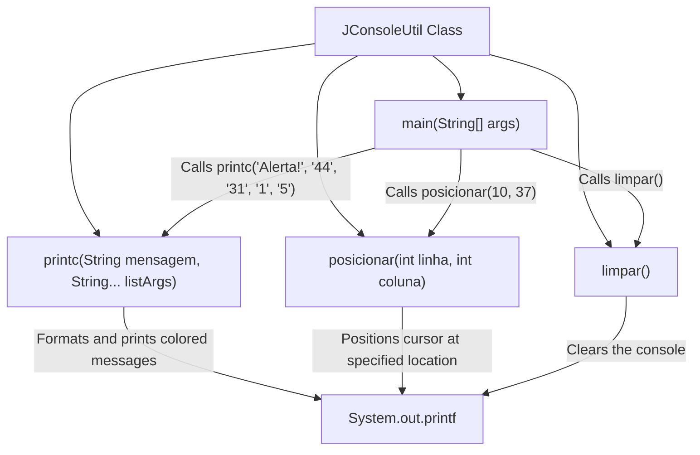
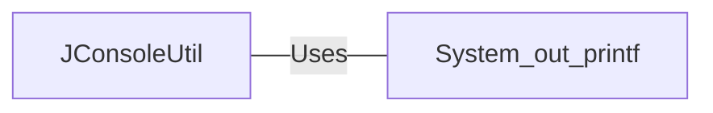

# Table of Contents
 - [JConsoleUtil.java: Console Utility for ANSI Mode Operations](#jconsoleutiljava-console-utility-for-ansi-mode-operations)
---

# JConsoleUtil.java: Console Utility for ANSI Mode Operations

## Overview

The `JConsoleUtil` class provides utility methods for performing various console operations in ANSI mode. These operations include printing colored messages, positioning the cursor, and clearing the console. The class is designed to facilitate console-based applications with enhanced visual output.

## Process Flow

## Insights

- The `printc` method constructs an ANSI escape code string to print colored messages on the console.
- The `posicionar` method uses ANSI escape codes to move the cursor to a specified position in the console.
- The `limpar` method clears the console using an ANSI escape code.
- The `main` method demonstrates the usage of the utility methods by clearing the console, positioning the cursor, and printing a colored message.

## Dependencies

- `System_out_printf`: Utilized for printing formatted strings to the console.

---

